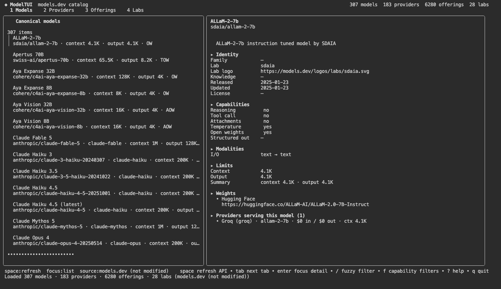
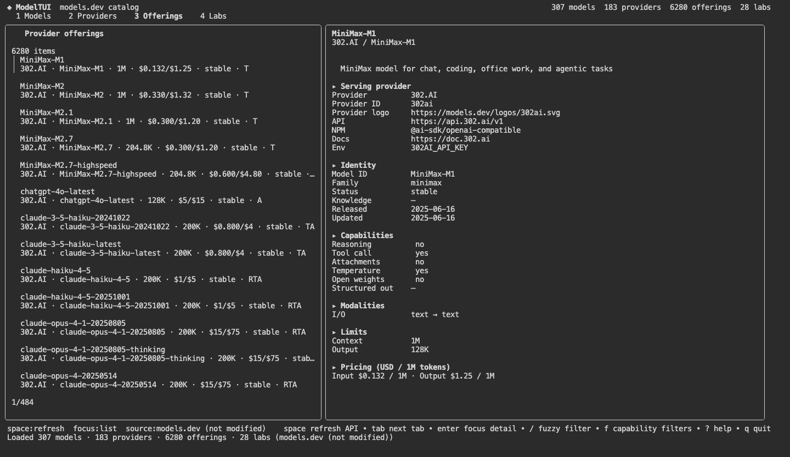
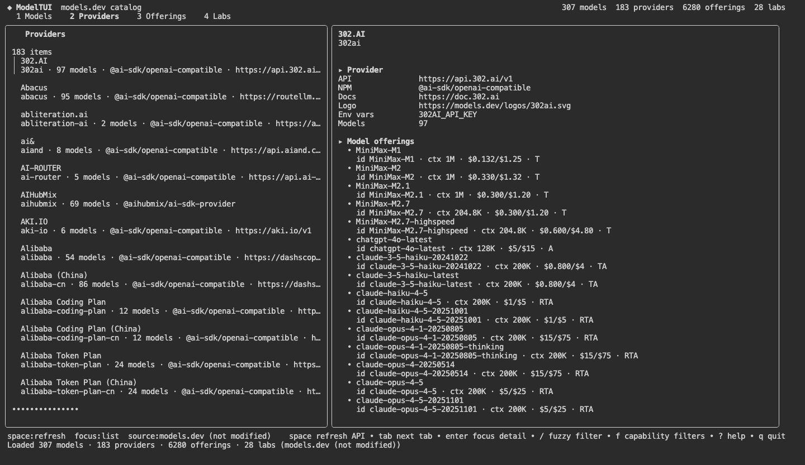

<p align="center">
  
</p>

<h1 align="center">ModelTUI</h1>

<p align="center">
  <strong>The glamorous terminal catalog for <a href="https://models.dev">models.dev</a></strong><br/>
  Browse every model, provider, offering, lab, price, limit, modality, and benchmark — animated with Charm.
</p>

<p align="center">
  <a href="#install"></a>
  <a href="https://models.dev"></a>
  <a href="https://charm.land"></a>
</p>

---

## Install (adds to PATH)

```bash
curl -fsSL https://raw.githubusercontent.com/desenyon/ModelTUI/main/install.sh | bash
```

Then start:

```bash
modeltui
```

> Opens a new shell (or `export PATH="$HOME/.local/bin:$PATH"`) if the binary isn’t found yet.

### From source

```bash
go install github.com/desenyon/ModelTUI/cmd/modeltui@latest
modeltui
```

### Update

```bash
modeltui update
```

Self-updates from the latest GitHub release for your OS/arch.

---

## Screenshots

<p align="center">
  
</p>

<p align="center">
  
</p>

---

## Features

- **Everything from models.dev** — canonical models, providers, 6k+ offerings, labs, logos, env vars, pricing tiers, reasoning options, interleaved/experimental JSON, benchmarks, weights
- **Space to refresh** — polite API refresh with **45s spacing**, **ETag / 304**, and **HTTP 429 Retry-After** backoff
- **Auto-refresh** every 15 minutes when idle (same rate limits)
- **Self-update** via `modeltui update`
- **Charm stack** — Bubble Tea v2, Bubbles, Lip Gloss + CharmTone, Harmonica springs, Glamour, Huh filters, Fang CLI, Bubble Zone

## Keys

| Key | Action |
|---|---|
| `space` | Refresh catalog (rate-limit aware) |
| `1`–`4` / `tab` | Models · Providers · Offerings · Labs |
| `/` | Fuzzy filter |
| `f` | Capability filters |
| `enter` / `esc` | Focus detail / back to list |
| `ctrl+r` | Same as space |
| `?` | Help |
| `q` | Quit |

## Rate limiting

ModelTUI never hammers models.dev:

| Guard | Value |
|---|---|
| Minimum spacing | 45s between network hits |
| Auto-refresh | every 15m |
| Conditional GET | `If-None-Match` / `304` |
| Backoff | honors `Retry-After` (capped at 30m) |
| Offline | disk cache → embedded snapshot |

Press **space** anytime — if you’re inside the spacing window, the UI tells you when to try again.

## Dev

```bash
make run      # go run ./cmd/modeltui
make build    # bin/modeltui
make test
```

## License

MIT
