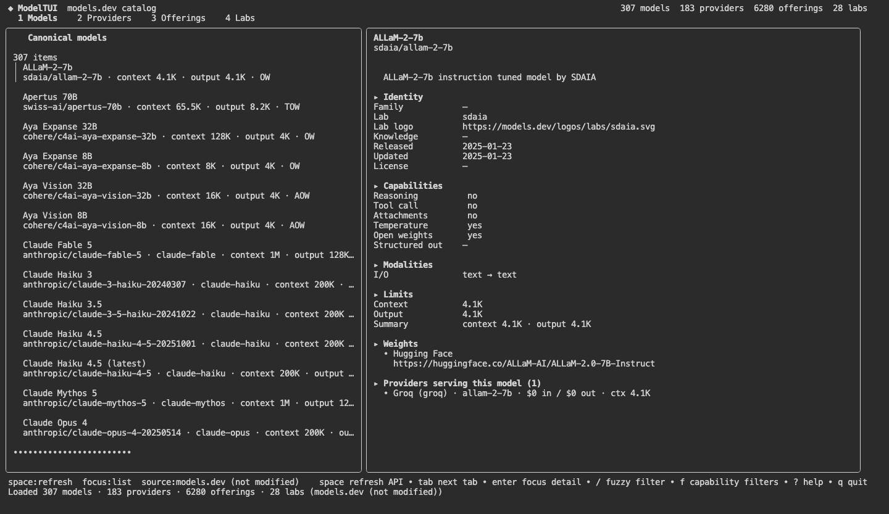
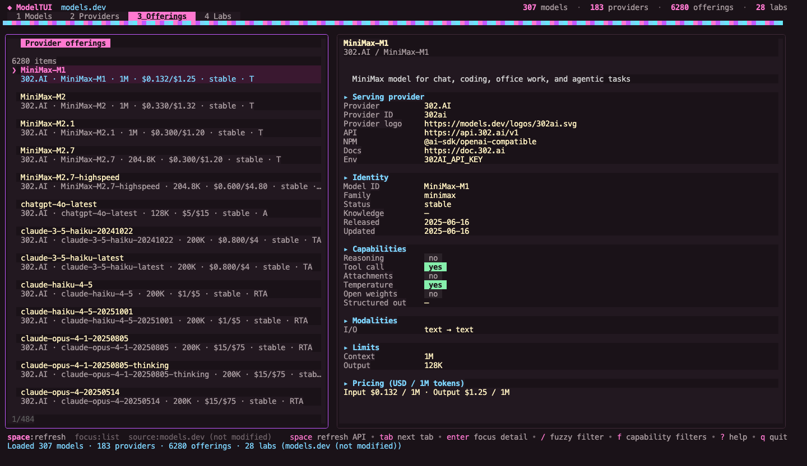
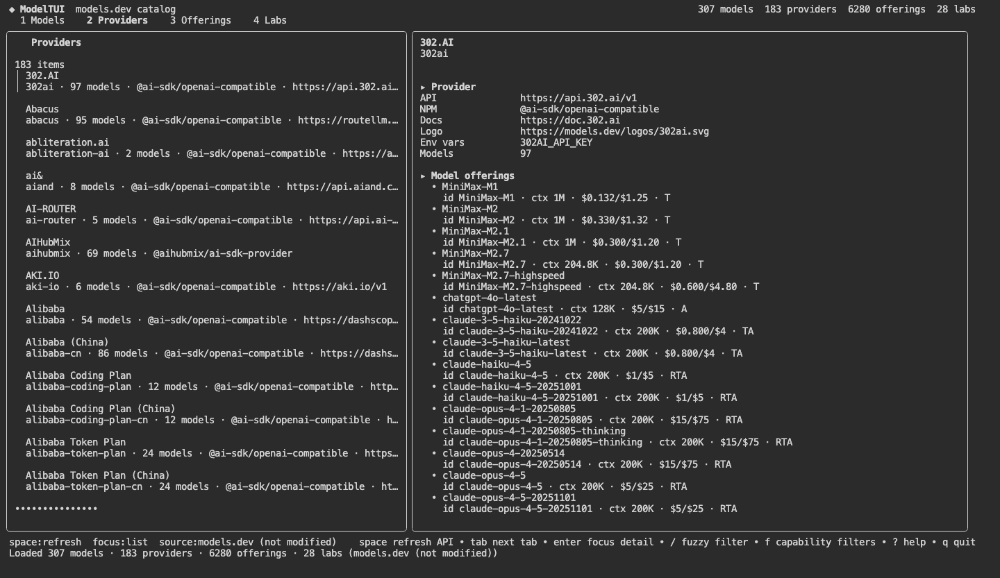

<p align="center">
  
</p>

<h1 align="center">ModelTUI</h1>

<p align="center">
  <strong>The glamorous terminal catalog for <a href="https://models.dev">models.dev</a></strong><br/>
  Explore AI models, providers, offerings, labs, pricing, limits and capabilities — animated with Charm.
</p>

<p align="center">
  <a href="https://github.com/desenyon/ModelTUI/actions/workflows/ci.yml"></a>
  <a href="https://models.dev"></a>
  <a href="https://charm.land"></a>
</p>

ModelTUI is a **catalog browser**, not an inference client: it does not run models,
read provider API keys, or send prompts. Open the four-tab terminal UI, or use the
headless `list` command to filter provider offerings and export JSON for scripts.
An embedded snapshot keeps both interfaces usable without a network connection.

## Install

### Release installer (macOS and Linux)

```bash
curl -fsSL https://raw.githubusercontent.com/desenyon/ModelTUI/main/install.sh | bash
modeltui
```

The installer downloads the latest release archive for macOS/Linux on amd64/arm64,
installs to `~/.local/bin`, and adds that directory to your shell configuration.
Open a new shell if `modeltui` is not found, or run:

```bash
export PATH="$HOME/.local/bin:$PATH"
```

Review `install.sh` before running it if you prefer. Set `MODELTUI_INSTALL_DIR`
to choose another install directory; `MODELTUI_REPO` overrides the release
repository used by the installer. These variables configure the installer only.
A source branch may contain features not yet present in the latest release.

### From source

Requires **Go 1.26.4 or newer**, Git, and access to the Go module proxy on first
build. No database, API key or Node.js installation is required.

```bash
git clone https://github.com/desenyon/ModelTUI.git
cd ModelTUI
make build
./bin/modeltui
```

Or install the repository's latest version into `$(go env GOPATH)/bin`:

```bash
go install github.com/desenyon/ModelTUI/cmd/modeltui@latest
```

For this improvement branch before it is merged/released, use
`git switch codex/catalog-reliability-cli` after cloning, or check out a specific
commit for a reproducible build. Source builds report `dev` unless you set the
version using the same linker flag as `.github/workflows/release.yml`.

## Interactive browsing

```bash
modeltui                       # Try live catalog; fall back to cache/snapshot
modeltui --offline             # Never request catalog data over the network
modeltui --timeout 10s          # Bound each catalog request
modeltui --cache-dir ./cache    # Isolate cached data and request metadata
```

The tabs contain canonical model metadata, serving providers, individual provider
model offerings, and labs grouped from canonical model IDs. Pricing belongs to
**offerings**: different providers can price the same model differently.

| Key | Action |
|---|---|
| `1`–`4` | Models · Providers · Offerings · Labs |
| `tab` / `shift+tab` or left/right | Next / previous tab |
| Up/down, page keys | Move through list or focused detail |
| `/` | Fuzzy text filter in the current list |
| `f` | Capability filter form; select with space and submit with enter |
| `enter` / `esc` | Focus detail / return to list |
| `space` / `ctrl+r` | Refresh catalog, respecting spacing and backoff |
| `?` | Toggle extended help |
| `q` / `ctrl+c` | Quit; while editing a filter, its form owns input |

Capability filters intersect: selecting reasoning and tools requires both.
They affect Models and Offerings; Providers and Labs retain their full lists.
The free-price filter matches offerings only, since canonical models have no
provider pricing. The filter form commits changes on completion and discards
changes on cancellation. Offline mode disables manual and automatic refresh.

The TUI uses a full-screen alternate buffer, a dark theme and rich color. A
roomy terminal (about 100×30 or larger) works best. `NO_COLOR` stops the command
from forcing TrueColor; the UI still uses Charm's terminal rendering behavior.

## Search and export without a terminal

`list` returns provider offerings. It works in pipes and CI without opening the
TUI or entering an alternate screen.

```bash
modeltui list --offline --limit 10
modeltui list --query claude --provider anthropic
modeltui list --capability reasoning,tools --min-context 128000 --sort input-price
modeltui list --offline --sort context --limit 20 --format json > offerings.json
modeltui list --offline --capability open-weights,multimodal --format json
```

| Option | Default | Behavior |
|---|---|---|
| `--query` | empty | Case-insensitive substring of model/provider ID, name, family, description or status |
| `--provider` | empty | Exact provider ID, such as `anthropic`; not a display name |
| `--capability` | none | Comma-separated or repeated required capabilities |
| `--min-context` | `0` | Minimum context window, in tokens |
| `--sort` | `name` | `name`, `context` (largest first), `input-price` or `output-price` (lowest first) |
| `--limit` | `0` | Maximum returned rows; zero returns all |
| `--format` | `table` | `table` or `json` |

Capabilities: `reasoning`, `tools`, `attachments`, `open-weights`,
`structured-output`, `multimodal`, `free`. Filters are combined with AND.
Unknown capabilities/sort/format values, negative limits and extra positional
arguments fail before loading the catalog. An unmatched query succeeds with zero
results. Price sorting puts offerings with no cost object last. Equal sort values
use model name, provider ID and model ID to keep ordering deterministic.

Table mode writes its source/count summary to **stderr** and rows to **stdout**.
JSON mode writes only a JSON document to stdout:

```json
{
  "source": "embedded snapshot",
  "count": 0,
  "offerings": []
}
```

Each nonempty offering has `provider_id`, `provider_name`, and a `model` object
containing the modeled upstream metadata. `count` is the number returned **after**
filtering and limiting. Empty results use `[]`, not `null`. Source identifies live
responses, validated HTTP 304 responses, disk cache or the embedded snapshot.

## Configuration and data lifecycle

Global flags work with the TUI and `list`:

| Flag | Default |
|---|---|
| `--offline` | `false` |
| `--timeout` | `45s`; must be positive |
| `--cache-dir` | `<os.UserCacheDir()>/modeltui` |

Typical cache roots are `~/Library/Caches` on macOS and `$XDG_CACHE_HOME` or
`~/.cache` on Linux. If Go cannot resolve a user cache directory, ModelTUI uses
the system temporary directory. `--cache-dir` overrides the complete ModelTUI
cache directory, not just its parent.

Online startup tries `https://models.dev/catalog.json` when allowed. Failure or
throttling falls back to a valid disk cache, then the bundled snapshot. Offline
startup skips the HTTP attempt and reads the same fallbacks without writing
cache files. Explicit caller cancellation stops loading instead of being hidden
by a fallback. The UI and CLI share catalog parsing and request policy.

| Policy | Value / behavior |
|---|---|
| Minimum spacing | 45 seconds between request starts, including manual refresh |
| Automatic refresh | 15 minutes after the last successful response |
| HTTP 429 | Honor numeric/date `Retry-After`, capped at 30 minutes; default 90 seconds |
| Cache freshness label | Older than 12 hours, or unknown age, is stale |
| Response/cache size | Maximum 32 MiB |
| Conditional GET | Send ETag only when endpoint and cached-content digest match |
| Invalid data | Reject missing/null catalog maps and malformed JSON; preserve prior cache |
| Persistence failure | Keep valid live data and in-memory throttling; source reports cache unavailable |

The cache has two files: `catalog.json` contains normalized model/provider data;
`rate.json` contains timestamps, backoff, endpoint, ETag and a SHA-256 digest of the
cached payload. Each write uses a unique temporary file followed by atomic rename.
The payload is saved before its validator metadata. A missing, changed or corrupt
cache prevents an old ETag from triggering an unusable 304 response.

Request serialization protects callers sharing a client, and persisted metadata
carries throttling across sequential launches. It is **not a cross-process lock**:
simultaneous independent processes can each make a request. Do not run many
independent instances against the public catalog service.

### Migration from the initial release

No manual migration is needed. Existing `catalog.json` remains readable. Legacy
`rate.json` lacks the endpoint/digest binding, so its ETag is discarded and the next
allowed request is unconditional. Default-endpoint timestamps/backoff remain
respected. Newly written metadata adds the binding fields. Unknown JSON fields are
ignored, allowing future upstream additions; this is a typed export, not a byte-for-byte
archive of every upstream field. The embedded snapshot is updated manually by
replacing `internal/catalog/catalog.snapshot.json` with a validated catalog.

## Self-update

```bash
modeltui version
modeltui update
```

The updater checks the latest stable GitHub release and selects
`modeltui_<version>_<os>_<arch>.tar.gz`, matching the release workflow. It compares
numeric `major.minor.patch` versions, avoids downgrades, and rejects development
or prerelease version strings with an explicit source-build instruction/error.
`--offline update` fails without contacting GitHub.

Downloads are limited to 64 MiB compressed and the executable to 128 MiB. The
archive must contain exactly one nonempty regular file named `modeltui`; paths,
symlinks, duplicate entries, corrupt gzip checksums and truncated archives are
rejected. After full validation, the executable is replaced atomically on
supported macOS/Linux filesystems. Failed validation leaves the old binary intact.
The executable's directory must be writable. Existing symlink installs resolve
to their target. Updates trust GitHub HTTPS release assets; there is no separate
signature or checksum manifest verification. The updater does not invoke the
shell installer or modify shell configuration.

## Architecture

```text
cmd/modeltui       Cobra/Fang flags, cancellation, TUI entry, table/JSON output
       │
       ├── internal/ui       Bubble Tea state, lists, filters, details, animation
       │        │
       ├────────┴── internal/catalog
       │              client.go     Parsing, bounded reads, atomic cache writes
       │              ratelimit.go  HTTP lifecycle, validators, backoff, fallback
       │              index.go      Deterministic views over catalog maps
       │              query.go      Shared capability predicates and CLI queries
       │              types.go      Typed catalog schema
       │              *.snapshot.json  Embedded offline data
       ├── internal/format   Display values, price/limit blocks
       └── internal/update   Release selection and bounded archive replacement
```

UI startup, manual refresh and background refresh use one configured client and
the caller's context. Refresh timers carry a generation number so superseded
timers cannot start extra refresh chains. Forms keep their pending selection
separate from applied filters. Network/storage code does not depend on terminal
rendering, and headless queries do not need to initialize UI state.

## Development and verification

```bash
make run          # Start the TUI from source
make build        # Build bin/modeltui
make test         # Entire Go test suite
make test-race    # Entire suite with Go's race detector
make vet          # Go static analysis / type checking
make fmt-check    # Verify formatting; make fmt applies formatting
make smoke        # Build + offline CLI and real PTY smoke checks
make check        # Formatting, vet, race tests, build, smoke
```

Smoke checks require Python 3.9+ and a Unix PTY (macOS/Linux); no Python packages
are installed. They use a fresh temporary cache, check JSON/table output and
validation failures, render the offline TUI, send navigation/quit keys, and require
clean exit. Go transport/updater tests use local `httptest` servers and temporary
files; they do not query production models.dev/GitHub or replace your installed
binary. Test environments must permit localhost listeners. Race tests require a
working C toolchain supported by Go.

CI runs `make check` on Ubuntu and macOS for branches and pull requests. The
release workflow remains tag-triggered and builds macOS/Linux amd64/arm64 archives.
To keep local verification modest on a shared machine:

```bash
GOMAXPROCS=2 GOFLAGS=-p=2 make check
```

The design and implementation scope are recorded in
[docs/upgrade-design.md](docs/upgrade-design.md) and
[docs/upgrade-plan.md](docs/upgrade-plan.md).

## Limitations and troubleshooting

- The snapshot and cached catalog can be old. Check the source label; `--offline`
  intentionally provides no freshness guarantee. A cache write failure does not
  stop browsing, but later processes cannot reuse that response or its rate state.
- Pricing is upstream metadata, usually USD per million tokens. Free/price sorting
  considers base input/output only, not tier thresholds, caching, audio, reasoning
  surcharges or provider availability. A missing cost object is unavailable;
  omitted individual numeric cost fields currently decode as zero.
- Canonical-to-provider links use ID matching heuristics. Provider aliases can be
  ambiguous; a match is not a guarantee that deployments are identical.
- Very small terminals may clip the two-pane layout. Use a larger terminal or
  `list`. Screenshots below show the original visual style; live data varies.
- A refresh reported as rate limited is expected within 45 seconds or an active
  429 backoff. Changing `--timeout` does not bypass that policy.
- If cache data is damaged, the client falls back to the embedded snapshot and an
  allowed online refresh repairs it. Use a fresh `--cache-dir` to diagnose cache
  permission problems without deleting existing files.
- If updating fails due to permissions, reinstall using your chosen install path
  or rebuild from source. A `dev` build should be upgraded with `go install` or Git.

## Screenshots

<p align="center">
  
</p>
<p align="center">
  
</p>

## License

[MIT](LICENSE). Catalog content is supplied by [models.dev](https://models.dev).
